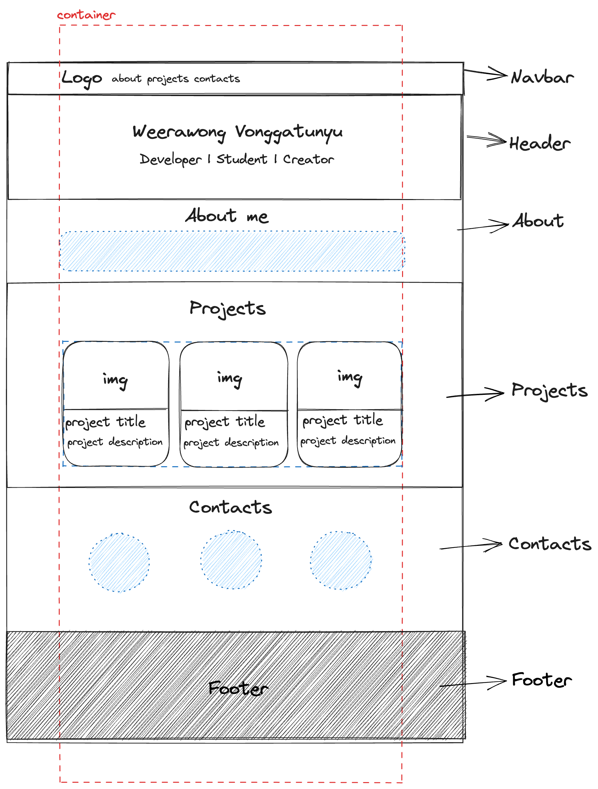

# Tech Camp 1 Workshop

## Portfolio Website

### Step 1

ออกแบบหน้าตาโครงสร้างเว็บไซต์คร่าว ๆ ด้วย [Excalidraw](https://excalidraw.com/)



### Step 2

ขึ้นโครงสร้างเริ่มต้น เขียน comment กําหนดส่วนต่าง ๆ ที่จะมีบนหน้าเว็บตามแบบที่ design ไว้

```html
<!DOCTYPE html>
<html lang="en">
<head>
  <meta charset="UTF-8">
  <meta http-equiv="X-UA-Compatible" content="IE=edge">
  <meta name="viewport" content="width=device-width, initial-scale=1.0">
  <title>My portfolio</title>

</head>
<body>
  <!-- Navbar -->


  <!-- Header  -->


  <!-- About me -->


  <!-- Projects -->


  <!-- Contacts -->


  <!-- Footer -->

</body>
</html>
```

### Step 3

ติดตั้ง bootstrap และทําการก็อปตัว component จาก bootstrap มาใส่ใน file html ของเรา อ้นที่เราจะใช้

```html
<!DOCTYPE html>
<html lang="en">
<head>
  <meta charset="UTF-8">
  <meta http-equiv="X-UA-Compatible" content="IE=edge">
  <meta name="viewport" content="width=device-width, initial-scale=1.0">
  <title>My portfolio</title>

  <link
      href="https://cdn.jsdelivr.net/npm/bootstrap@5.3.0/dist/css/bootstrap.min.css"
      rel="stylesheet"
      integrity="sha384-9ndCyUaIbzAi2FUVXJi0CjmCapSmO7SnpJef0486qhLnuZ2cdeRhO02iuK6FUUVM"
      crossorigin="anonymous"
    />
</head>
<body>
  <!-- Navbar -->
  <nav class="navbar navbar-expand-lg bg-body-tertiary">
    <div class="container-fluid">
      <a class="navbar-brand" href="#">Navbar</a>
      <button class="navbar-toggler" type="button" data-bs-toggle="collapse" data-bs-target="#navbarNav" aria-controls="navbarNav" aria-expanded="false" aria-label="Toggle navigation">
        <span class="navbar-toggler-icon"></span>
      </button>
      <div class="collapse navbar-collapse" id="navbarNav">
        <ul class="navbar-nav">
          <li class="nav-item">
            <a class="nav-link active" aria-current="page" href="#">Home</a>
          </li>
          <li class="nav-item">
            <a class="nav-link" href="#">Features</a>
          </li>
          <li class="nav-item">
            <a class="nav-link" href="#">Pricing</a>
          </li>
          <li class="nav-item">
            <a class="nav-link disabled">Disabled</a>
          </li>
        </ul>
      </div>
    </div>
  </nav>


  <!-- Header  -->


  <!-- About me -->


  <!-- Projects -->


  <!-- Contacts -->


  <!-- Footer -->


  <script
      src="https://cdn.jsdelivr.net/npm/bootstrap@5.3.0/dist/js/bootstrap.bundle.min.js"
      integrity="sha384-geWF76RCwLtnZ8qwWowPQNguL3RmwHVBC9FhGdlKrxdiJJigb/j/68SIy3Te4Bkz"
      crossorigin="anonymous"
  ></script>
</body>
</html>
```

## Step 4

ดัดแปลงให้เป็นตัวเรา เปลี่ยนข้อความ รูปภาพ สีพื้นหลัง ๆลๆ

```html
<!DOCTYPE html>
<html lang="en">
<head>
  <meta charset="UTF-8">
  <meta http-equiv="X-UA-Compatible" content="IE=edge">
  <meta name="viewport" content="width=device-width, initial-scale=1.0">
  <title>My portfolio</title>

  <link
      href="https://cdn.jsdelivr.net/npm/bootstrap@5.3.0/dist/css/bootstrap.min.css"
      rel="stylesheet"
      integrity="sha384-9ndCyUaIbzAi2FUVXJi0CjmCapSmO7SnpJef0486qhLnuZ2cdeRhO02iuK6FUUVM"
      crossorigin="anonymous"
    />

</head>
<body>
  <!-- Navbar -->
  <nav class="navbar navbar-expand-lg navbar-dark bg-dark">
    <div class="container">
      <a class="navbar-brand" href="#">My Portfolio</a>
      <button class="navbar-toggler" type="button" data-bs-toggle="collapse" data-bs-target="#navbarNav" aria-controls="navbarNav" aria-expanded="false" aria-label="Toggle navigation">
        <span class="navbar-toggler-icon"></span>
      </button>
      <div class="collapse navbar-collapse" id="navbarNav">
        <ul class="navbar-nav">
          <li class="nav-item">
            <a class="nav-link active" aria-current="page" href="#">About</a>
          </li>
          <li class="nav-item">
            <a class="nav-link" href="#">Projects</a>
          </li>
          <li class="nav-item">
            <a class="nav-link" href="#">Contacts</a>
          </li>
        </ul>
      </div>
    </div>
  </nav>


  <!-- Header  -->


  <!-- About me -->


  <!-- Projects -->


  <!-- Contacts -->


  <!-- Footer -->


  <script
      src="https://cdn.jsdelivr.net/npm/bootstrap@5.3.0/dist/js/bootstrap.bundle.min.js"
      integrity="sha384-geWF76RCwLtnZ8qwWowPQNguL3RmwHVBC9FhGdlKrxdiJJigb/j/68SIy3Te4Bkz"
      crossorigin="anonymous"
  ></script>

</body>
</html>
```

และวนทําข้อ 3 และ 4 ไปเรื่อย ๆ จนกว่าจะได้ตรงตามที่เราออกแบบไว้